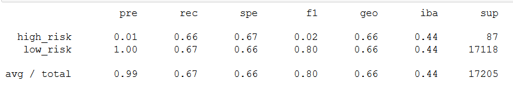
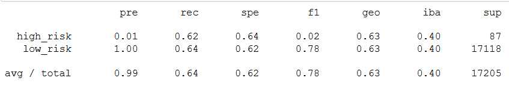
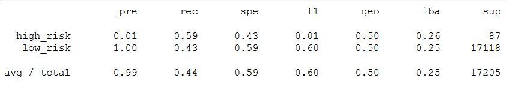
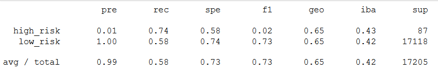
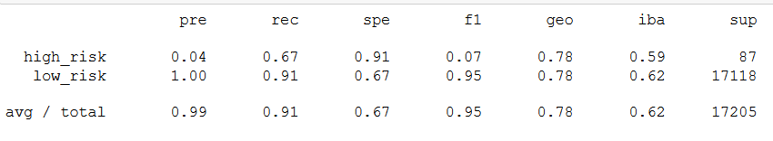
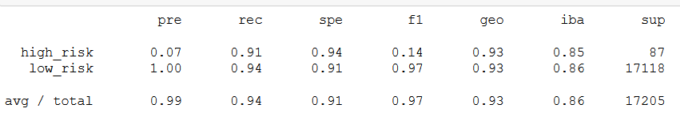

# Credit Risk Analysis

## Overview of the analysis

This analysis is being done on a banks loans default dataset and using different machine learning models to see which model provides a better result in predicting loan default risk. The initial analysis is done by oversampling the data with <b>RandomOverSampler</b> and <b>SMOTE</b> algorithms, and then undersampled by <b>ClusteredCentroids</b> algorithm. This helps in finding out the bias in the data. Later on, both the over and under sampling are combined by using the <b>SMOTEEN</b> algorithm. Finally, to reduce bias, <b>BalancedRandomClassifier</b> and <b>EasyEnsembleClassifier</b> is used. Overall, they are all used to answer one question, is any of them effective in predicting credit risk.

We will be using the <b>imbalanced-learn</b> and <b>scikit-learn</b> libraries from python to use these algorithms.

## Results

At a glance, the results of the six models mentioned above were as follows:

- <b>RandomOverSampler</b>: The RandomOverSampler model had a balanced accuracy score of 66%, with a precision of 1% and recall score of 66% for high risk loans.
</img>
- <b>SMOTE</b>: The SMOTE model had a balanced accuracy score of 63%, with a precision of 1% and recall score of 62% for high risk loans.
</img>
- <b>ClusteredCentroids</b>: The ClusteredCentroids model had a balanced accuracy score of 51%, with a precision of 1% and recall score of 59% for high risk loans.
</img>
- <b>SMOTEEN</b>: The SMOTEEN model had a balanced accuracy score of 65%, with a precision of 1% and recall score of 74% for high risk loans.
</img>
- <b>BalancedRandomClassifier</b>: The BalancedRandomClassifier model had a balanced accuracy score of 79%, with a precision of 4% and recall score of 67% for high risk loans.
</img>
- <b>EasyEnsembleClassifier</b>: The EasyEnsembleClassifier model had a balanced accuracy score of 93%, with a precision of 7% and recall score of 91% for high risk loans.
</img>

## Summary

Overall, the results from most of the models can be interpreted as having a fair rate of predicting low risk loans, but underperforming in predicting high risk loans. The worst in terms of performance would be the <b>ClusteredCentroids</b> model with a balanced accuracy score of 51%. The best in terms of performance would be the <b>EasyEnsembleClassifier</b> model, as it has the highest accuracy of 93% and both the precision and recall scores above the other models.

However, if there is any more option to train the models based on high risk loans it would be better to train the models on that. The low number of high risk loans makes the prediction models really ineffective, and both over and under sampling seems unable to raise the precision score above 5%. Based on the results, <b>no model can be recommended</b> with the current dataset as they can not achieve a precision of more than 7%.
